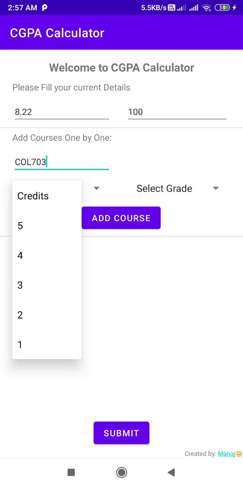
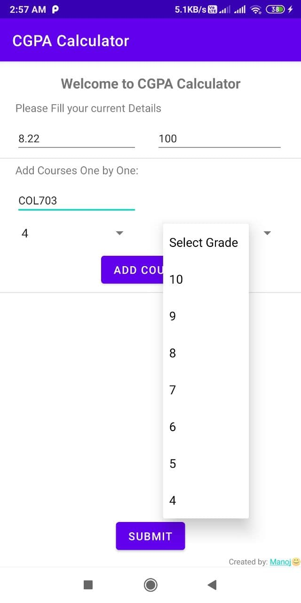
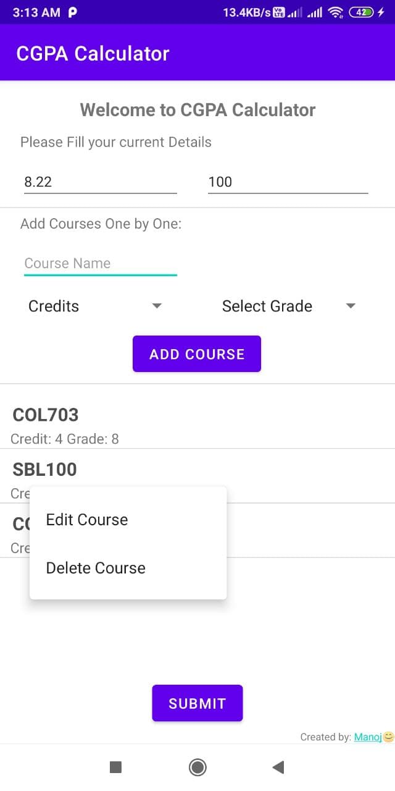

# CGPA-Calculator
  

An android app that calculates your CGPA and SGPA based on your previous CGPA, total earned credits, and grades in your current courses.  

* dynamic size of total current courses.
* User can add and remove the current course.
* User can update a previously added course.

### Main Screen:
* This is the main screen of the app. Users need to add their current CGPA and total earned credits till last semester (If you are in the first semester, then you must fill both with 0).  
  
  
* Now User can add the course name as below. (Course name field is optional)
  
<!--    -->
  
* Select the Credits from the drop down menu. (Range: 1-5)  
  
  
* Select the Grade from the drop down menu. (Range: 4-10)  
  
  
* Now click on `ADD COURSE` button. The course will be added and will look like this.  
  
  
* Similarly you can add multiple courses like this:  
  
  
* Click on `SUBMIT` and you will see your result below:
  
  
* If you want to update a course, long press on that course and you'll see the following options:
  
  
* Click on `Delete Course`, if you want to delete the course. Click on `Edit Course` to edit course name, credit or grade, it will show like this, after the edit, again click on `ADD COURSE` to reflect the changes.
  

## Contributions:
* [Manoj Kumar](https://github.com/manoj2601)

<h2> About The Author:</h2>
I'm Manoj Kumar, pursuing 4th year Dual(B.Tech + M.Tech) in Computer Science and Engineering, IIT Delhi, with roots at Kuchaman City, Rajasthan in western India. At present, living in New Delhi.  
Outside Tech, I love to read, enjoy music and explore nature outdoors. If you are around New Delhi, drop an email and let's catch-up over Coffee!

- Check out my [webpage](https://www.cse.iitd.ac.in/~cs5180411/) to know more.

* If you like it, please give it a **star** :star: .
* If you want to give any suggestions for new features or want to report a bug, kindly create an **issue** on this repository. To have a chat with me, message me on [gitter](https://gitter.im/manoj2601).